# Memory Match	
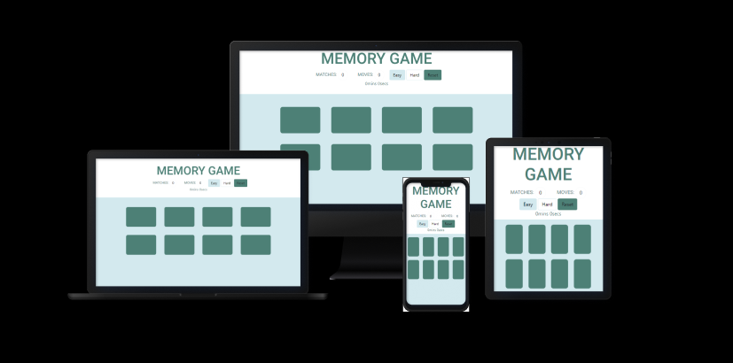

## Goal For This Project	
Welcome from Memory Match, an intuitive game that anyone can play.
Memory Match is an online card memory game that is targeted at users that enjoy logic and/or brain games.

The live site can be found [here](https://keeks-mtl.github.io/memory-match/).

## Table of Contents
- [Memory Match](#memory-match)
  * [Goal For This Project](#goal-for-this-project)
  * [Table of Contents](#table-of-contents)
  * [UX](#ux)
    + [Player Goals](#player-goals)
    + [User Stories](#user-stories)
    + [Game Creator Goals](#game-creator-goals)
    + [Wireframes](#wireframes)
      - [Modifications On Original Design](#modifications-on-original-design)
    + [Design Choices](#design-choices)
      - [Fonts](#fonts)
      - [Icons](#icons)
      - [Colours](#colours)
      - [Styling](#styling)
  * [Features](#features)
    + [Game Header](#game-header)
      - [Matches Display](#matches-display)
      - [Moves Display](#moves-display)
      - [Difficulty Buttons](#difficulty-buttons)
      - [Reset Button](#reset-button)
      - [Timer Display](#timer-display)
    + [Congratulations Modal](#congratulations-modal)
    + [Gameboard & Cards](#gameboard---cards)
    + [Features Left to Implement](#features-left-to-implement)
  * [Technologies Used](#technologies-used)
    + [Languages](#languages)
    + [Libraries, Frameworks & Tools](#libraries--frameworks---tools)
  * [Testing](#testing)
    + [Compatibility Testing](#compatibility-testing)
    + [Performance & Accessibility Testing](#performance---accessibility-testing)
    + [User Story Testing](#user-story-testing)
    + [Manual Testing](#manual-testing)
      - [Difficulty Testing](#difficulty-testing)
      - [Gameplay Testing](#gameplay-testing)
      - [Reset Button Testing](#reset-button-testing)
      - [WinModal Testing](#winmodal-testing)
  * [Bugs](#bugs)
    + [Cards Not Shuffling After Reset](#cards-not-shuffling-after-reset)
      - [Bug](#bug)
      - [Fix](#fix)
    + [Can Match Same Square](#can-match-same-square)
      - [Bug](#bug-1)
      - [Fix](#fix-1)
    + [Match Matched Cards](#match-matched-cards)
      - [Bug](#bug-2)
      - [Fix](#fix-2)
    + [Change Difficulty Bug](#change-difficulty-bug)
      - [Bug](#bug-3)
      - [Fix](#fix-3)
  * [Deployment](#deployment)
    + [Publishing](#publishing)
    + [Forking](#forking)
    + [Cloning](#cloning)
  * [Credits - Content - Media -Inspiration](#credits---content---media--inspiration)
  * [Acknowledgements](#acknowledgements)
  	
## UX	
Memory Match is a minimally styled game created for anyone with a little time on their hands that wants to test their 
memory skills.

### Player Goals	
- Play a fun game	
- Easy to play	
- Clear and intuitive gameplay without instructions	
  - Not a lot of buttons or areas to distract and only one main area to click	
- Not distracting on the eyes or busy	
  - simple colours and shapes	
- Visually keeps you interested	
  - sleek design	

### User Stories
- As a user, I want to navigate the website easily. 
- As a user, I want to start playing the game without much time investment (Reading instructions that complicate the process).
- As a user, I want to challenge my memory abilities.
- As a user, I want to be able to tell if I am doing better.
- As a user, I want to be able to play the game from all device types. 

### Game Creator Goals	
- A project that is interesting and requires some thought to code.
- A site that visitors can navigate without much thought and easily. 
- A game that is fun and looks clean and crisp. 	

### Wireframes	
- The wireframes were created using [Balsamiq](http://www.balsamic.com) during the design and planning part 
    of this project.

**Desktop site**

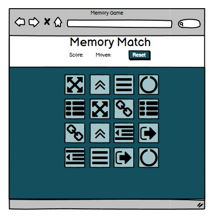

**Mobile site**

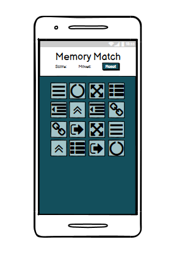

#### Modifications On Original Design
- From the original design the things displayed in the game header section were changed. 
    - The score was changed to a matches display
    - There was also a decision to add difficulty buttons to the game for an easy and hard version.
    - There was also a counter added to keep track of how long the game had been played before winning. 
- The colour theme was also changed from the original design to a light blue and a medium green.

### Design Choices	
- The game is meant to feel neat and mature as to not feel infantile.

#### Fonts	
- The goal was an overall cohesive feeling so I decided not to use multiple fonts, choosing the font 'Roboto'.	
- I wanted something contemporary but also clean & clear. The font was chosen 
    from [Google Fonts](https://fonts.google.com/) to make sure it worked across browsers/devices.	

#### Icons	
- The cards themselves use icons that should feel familiar. The icons were meant to be similar enough that 
    those playing wouldn't find it too easy to remember where each card was.
- The icons themselves are from [FontAwesome](https://fontawesome.com/) and are icons associated with computers
    so they would look familiar to most who have used computers before. 

#### Colours	
- The colour theme included two main colours that complimented one another. Two complimentary blue/green colours 
    where used so that there was a link to one another but also enough contrast so that everything didn't blend together.

**Colors Used**

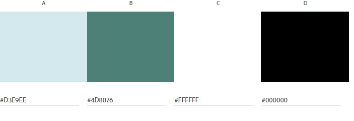

#### Styling	
- The cards themselves were given rounded corners so that the game didn't seem too sharp or rigid. The buttons and 
    win message shared the rounded corners to give a unifying feeling.	

## Features	

### Game Header

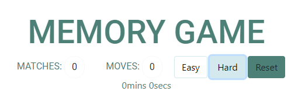

- Area of the game that shows the main information important to playing the game. 

#### Matches Display
- Shows how many pairs the user has found. 
#### Moves Display
- Shows how many moves the user has made at any time. 
#### Difficulty Buttons
- An easy and a hard button for users to press to play each difficulty setting. The difficulty the user
    is currently playing is highlighted.
- Easy setting has 8 cards and Hard setting has 16 cards

#### Reset Button
- The reset button resets the cards on the playing board and sets the matches display, moves display, and 
    timer display to 0. The difficulty remains on the setting the user was playing when they pressed the 
    reset button.
- The reset button is highlighted by using the darker colour so it stands out from other things in the game 
    header section.

#### Timer Display
- The timer display shows how long the user has been playing the game for. It starts after the user
    presses their first card. 

### Congratulations Modal	
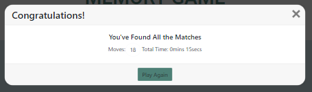

- Once the player has found all the matches a popup shows letting the player know they've won.	
- The popup lets the player know they've found all the pairs, how many moves it has taken, and how much time they've taken.	
- The popup lets the player choose to close the modal or replay the game.	

### Gameboard & Cards	
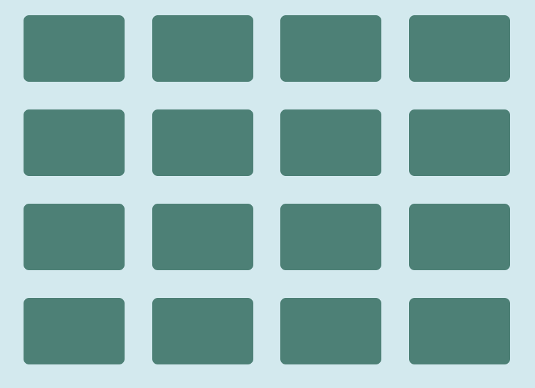

- The gameboard is where the cards are laid out so the player can choose one.	
- The grid is set out in rows of 4.	
- Once a card is pressed on the gameboard the card flips around and shows the icon. 

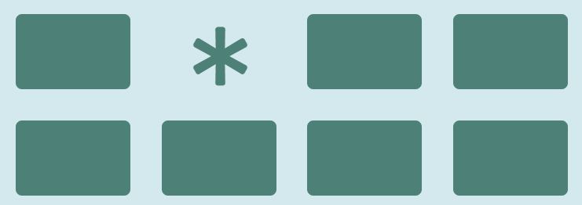

- Once two matching cards are found they disappear.

### Features Left to Implement	
- An extremely hard version of the game	
- High stats which everyone can compare their stats with one another.

## Technologies Used	
### Languages	
- HTML5	
    - The base of the code for the overall structure of the site.	
- CSS3	
    - For the styling of the site	
- JavaScript
    - For the game logic.

### Libraries, Frameworks & Tools	
- [Font Awesome](https://fontawesome.com/)	
  - The icons were used for the images on the cards	
- [Bootstrap](https://getbootstrap.com/)	
  - Was used for added styling and responsiveness of the project	
- [Google Fonts](https://fonts.google.com/)	
  - Used to import the main font for the styling of the project	
- [Github](https://github.com/)	
  - Used to store and push the code	
- [Visual Studio Code](https://code.visualstudio.com/)	
  - Used to code and push the code	
- [Google Developer Tools](https://developers.google.com/web/tools/chrome-devtools)	
  - Used to debug code and show styling changes before changing the actual code	
- [Balsamiq](https://balsamiq.com/)	
  - Used for creating the wireframes in the planning stage	
- [W3C HTML Validator](https://validator.w3.org/)	
  - Used as a HTML validator	
- [W3C CSS Validator](https://jigsaw.w3.org/css-validator/)	
  - Used as a CSS validator
- [JSHint](https://jshint.com/)	
  - Used as a JavaScript validator

## Testing	
- [W3C CSS Validator](https://jigsaw.w3.org/css-validator/) 
    - Used to validate CSS code.

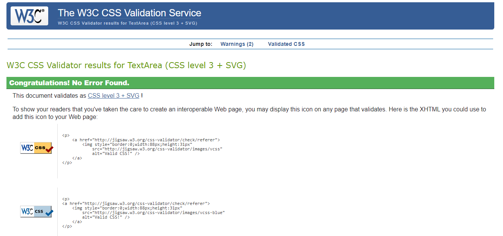

- [W3C HTML Validator](https://validator.w3.org/)	
    - Used to validate HTML code.

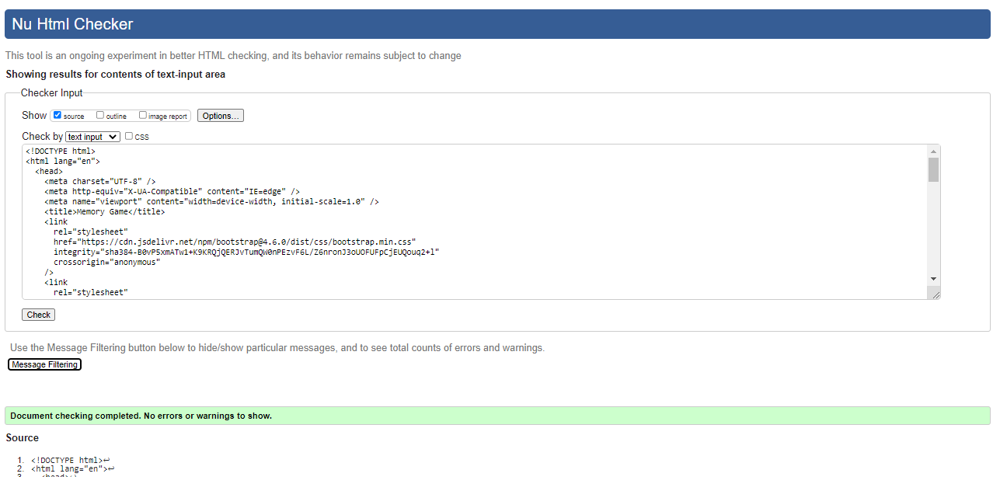

- [JSHint](https://jshint.com/)	
    - Used to validate JavaScript code. 

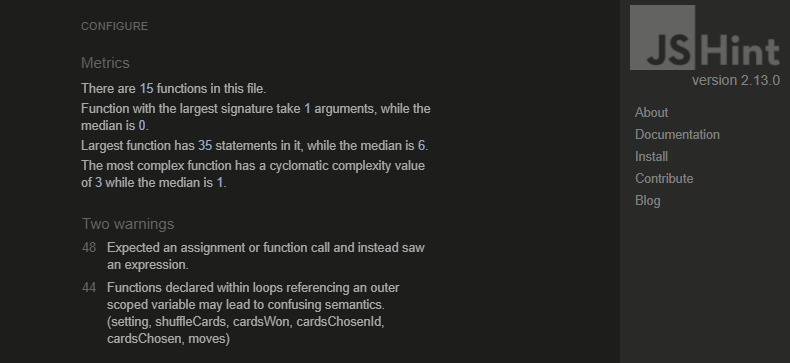

### Compatibility Testing
- The site was tested on Chrome & Edge browsers to check compatibility across browsers.
- The site was also tested on a laptop, an iPhone X, and Samsung Galaxy S20. The site was 
    also checked through Google Chrome Developer Tools to check other device sizes and test
    responsiveness. 

### Performance & Accessibility Testing 
- Google's Lighthouse tool was used to test the performance of the site to see if there were any issues.
- After the initial test showed a slightly low accessibility score, the reset button font color was changed
    to white and the final test results are as shown:

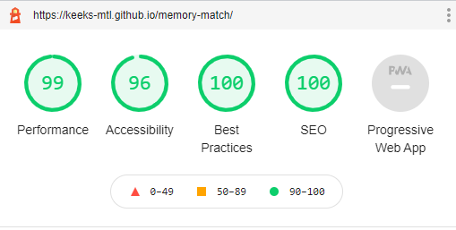

### User Story Testing

- As a user, I want to navigate the website easily
    - Make sure all buttons are easily seen and obvious what they do
- As a user, I want to start playing the game without much time investment
    - Visit the site and see how easy it is to understand how the game is played
- As a user, I want to challenge my memory abilities
    - Every time the game is reset make sure icons are in different places and it is easy to see
    how quickly and how many moves were made to find all pairs
- As a user, I want to be able to tell if I am doing better
    - Make sure it is easy to see how many moves and how long it took to finish the game
- As a user, I want to be able to play the game from all device types
    - Test the game on multiple device sizes and check how easy it is to see the game and play

### Manual Testing
#### Difficulty Testing
- Press the Easy button and make sure there are only 8 cards showing
- Press the Hard button and make sure there are 16 cards showing
- Press a card and then press a a difficulty button and make sure the amount of cards changes and 
    the display buttons return to 0. 

#### Gameplay Testing
- Press one card and then press the same card again and make sure nothing happens. 
- Press an empty space and make sure nothing happens.

#### Reset Button Testing
- Press a card and then press the reset button and make sure all counters return to zero.
- Press Easy button and then press reset button and make sure game stays on easy
- Press Hard button and then press reset button and make sure game stays on easy

#### WinModal Testing
- Find all matches and then press x on win modal and make sure the modal closes and the counters don't change.
- Find all matches and then press the play again button and make sure the modal closes and all the 
    counters return to zero. 

## Bugs	

### Cards Not Shuffling After Reset	
#### Bug	
- The cards weren't randomising after the reset button was pushed	
#### Fix	
- Found that I had put the sorting of the cards outside of the create board function	

### Can Match Same Square	
#### Bug	
- If you click twice on the same square you get a match.	
#### Fix	
- Added an if statement so can't click on same square twice	

### Match Matched Cards	
#### Bug	
- If you click twice on a pair of cards you've already matched then you can match them again.	
#### Fix	
- removed the click listener to the cards when they've been matched	

### Change Difficulty Bug
#### Bug 
- If you start playing and then click on a difficulty button it reshuffles the cards and changes the 
    difficulty setting but doesn't reset the counters to zero. 
#### Fix
- After calling shuffleCards() changed all the counters to 0.

## Deployment	

- Visual studio code was used as a development environment where I committed all changes to git version control system.
- All changes were pushed to GitHub. 
- This project has been deployed using GitHub pages and I have used the following process to do so:	

### Publishing	
1. Log in to GitHub and locate the GitHub Repository
2. At the top of the Repository, click on the "Settings" Button on the menu
3. Scroll down the Settings page until you locate the "Pages" Section
4. Under "Source", click the dropdown called "None" and select "Master" and click on save
5. Once the page refreshes, the now published site link shows at the top of the page.

The live site can be found [here](https://keeks-mtl.github.io/memory-match/)

### Forking	
You can fork a project to make a copy without it affecting the main branch with this process:	
- Log in to GitHub and find the repository that you wish to fork	
- Clicked on the repository and on the top right-hand side you will see three options: 'unwatch' 'star' and 'fork'	
- Once the fork button has been clicked, a copy of the repository will be in your GitHub account	

### Cloning	
You can clone the repository to your local device following these steps:	
- Choose the GitHub repository that you'd like	
- Click the 'code' button at the top right next to 'add file'	
- Copy the link that pops up	
- Open your terminal and choose the directory you would like the clone to be in	
- Type 'git clone' and paste the URL you copied afterwards and then click enter

## Credits - Content - Media -Inspiration
- [Code with Ania Kubów's youtube video](https://www.youtube.com/watch?v=tjyDOHzKN0w)
    - The base JavaScript code for the game that was adapted to my needs
- [Javascript.info](https://javascript.info/task/shuffle)	
    - Radomising the array for different cards
- [stackoverflow](https://stackoverflow.com/questions/34278816/how-to-add-a-timer-in-html5-and-javascript)
    - How to set timer
- [MDN](https://developer.mozilla.org/en-US/docs/Web/JavaScript/Reference/Operators/Spread_syntax)
    - How to use spread syntax
- [Florin Pop](https://www.florin-pop.com/blog/2019/03/css-pulse-effect/)
    - How to make a pulse animation
- [w3 Schools](https://www.w3schools.com/howto/howto_css_flip_card.asp)
    - How to do a flip card animation

## Acknowledgements	
- Special thanks to my mentor for advice and feedback
- The students on Slack for peer review and comments
- My friends for their endless support, feedback and testing
